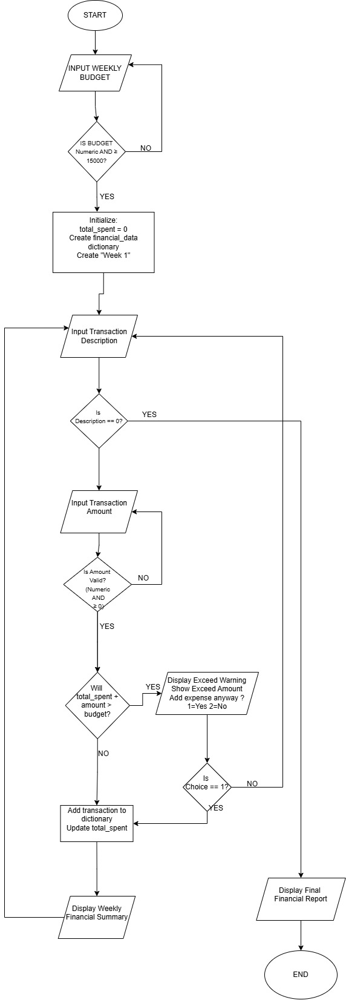

# Financial_Perosnal_Assistant-FPA-

PROJCET PLAN 
1. Project Goal 
- Accepts a fixed budget 
- Logs multiple expenses 
- Tracks total spending 
- Warns user when their expenses exceed the budget 
- Prints a financial report

## Flow Chart

## Phase 1: Requirements Breakdown 
- Prompt user to enter buddget that shall be initialized as budget_start
- Ensure the budget amount is numeric, non negative and maybe above a specific amount such as 15k to make it more realistic 
- Prints a final financial report. 

Data structure design 
We shall be using a dictionary of dictionaries of the sample format 
financial_data = {
    "Week 1": {
        "Lunch at Bobics": 15000,
        "Transport to Bugujju": 5000
    }
}

to store the week with its expenses and the inner dictionaries. 

For variables:
budget_start = to store initial budget per week 
total_spent = running cummulative expenses total 
transactions = a dictionary to store the weekly transactions
description = input for the expense name 
amount = input for the amount spent in the expense. 

Transaction Logging system
We shall use a while loop that runs until the user inputs something to terminate it i.e if user input for expense description is 0. 

For each transaction:
- Ask for description or the purchase 
- Ask for amount 
- Validate amount to see if it doesn't exceed the budget if it does notify the user before adding it and notify them by how much they are exceeding the budget and ask them if they would have to add the expense and give them a "Yes" = 1 or "No" = 2 option to choose from 
- Add to the list if they say "yes" to an expense that exceeds the budget or if expense doesn't exceed the budget
- Update the total 
- After every purchase, output the financial report for the week having the initial budget, total spent so far, amount left to spend, and the list of the items spent on i.e.

========= SESSION SUMMARY =========
Initial Budget: 200000 UGX
Total Spent: 215000 UGX
Deficit: 15000 UGX

Transactions:
1. Lunch at Bobics - 15000 UGX
2. Transport - 5000 UGX
3. Data bundle - 20000 UGX
...
====================================

